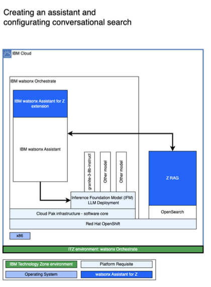

# Overview - Creating a zRAG Assistant

IBM watsonx Assistant for Z allows you to create and configure assistants with conversational search capabilities. Assistants can be configured to use conversational search against the zRAG containing a wide array of IBM Z documentation which comes by default with the zAssistDeploy service you deployed in the previous section.

The OpenSearch instance you deployed boasts over 220 knowledge sources and supports Retrieval Augmented Generation (RAG). In addition, the Large Language Model (LLM) providing conversational AI augments this knowledge based on IBM Z documentation, generating IBM Z context-aware responses to queries with content- grounded knowledge.

Clients can even personalize their assistant with an internal knowledge base that contains internal documentation they can add to the zRAG. This helps provide a level of context-awareness of their own enlivenment when environment-specific questions are asked to the assistant. You’ll see how that is possible later on in this Lab.

A high-level, logical architecture diagram of the environment you will be using is illustrated below:

In this section of the Lab, you will create a new assistant that is intended to provide accurate and reliable answers to a range of Z related questions, leveraging the content-grounded search capabilities provided with your previously deployed OpenSearch instance. The tasks involved include:

- Accessing your watsonx Orchestrate environment and creating a new zRAG Assistant 
- Configuring conversational search via your OpenSearch credentials for Q&A 
- Adjusting settings for conversational search
    - Contextual awareness
    - Confidence thresholds
    - Response lengths
    - Metadata filtering
- Fine-tuning the assistant behavior with Prompt Instructions 
- Verifying the assistant’s Q&A