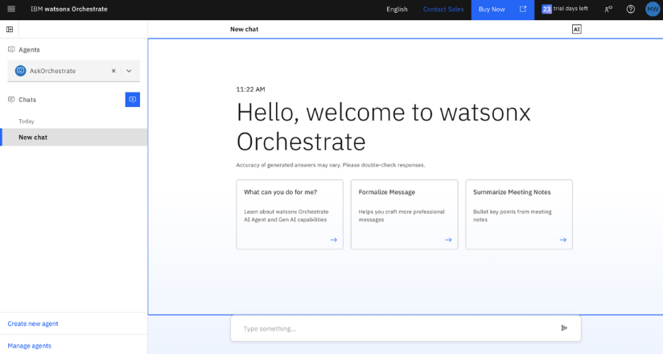

# Access your watsonx Orchestrate environment

1. To access your watsonx Orchestrate environment, navigate to your IBM Cloud SaaS ***Resource List*** by following the instructions in Section ***[Accessing the environment](../techzone/orchestrate.md#accessing-the-environment)***.

2. Once you’re viewing the **Resource List** in the IBM Cloud web console, expand the **AI / Machine Learning** section and click on the resource name associated with the ***watsonx Orchestrate*** product, as shown below:
   
    

3. This will take you to your **watsonx Orchestrate** resource. Click on **Launch watsonx Orchestrate** as shown below:
   
    

4. You should now be logged into the watsonx Orchestrate UI as shown below:
   
    