# Additional configuration

After you save and close the **Conversational search** configuration page, a few more configurations are needed to get the best experience from your conversational chat. Details on these settings are available <a href="https://www.ibm.com/docs/en/watsonx/waz/2.0.0?topic=cluster-configuring-your-assistant-use-zassistantdeploy" target="_blank">here</a>.


1. Hover your cursor over the left-side navigation and click **Actions**.
   
    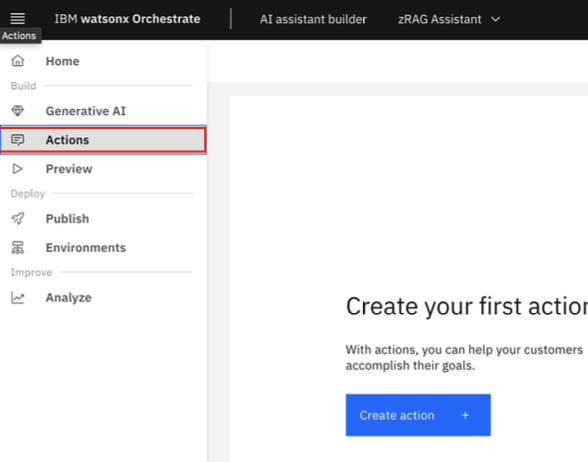

2. Click **Set by assistant** under the **All items** menu.
   
    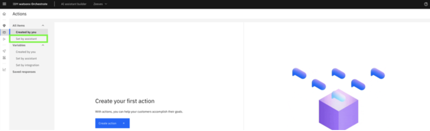

3. Select **No matches**. 

    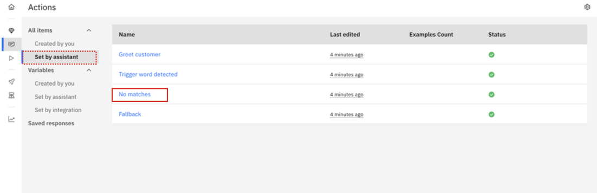

4. Under **Conversation steps**, select the first step and do the following:

    **a.** In the **Is taken** drop-down, select **Without conditions**. In the **Clear conditions?** Dialog box, click **Clear conditions**.

    **b.** In the **Assistant says** text box, delete the default text.

    **c.** In the **And then** drop-down, select **Search for the answer**.

    **d.** At the bottom of the page, click **Edit settings**, select the **After generation** tab, and then click the ***End the action after this step*** checkbox.

    **e.** Then click **Apply**.

    ***The configuration of Step 1 should look like the following:***

    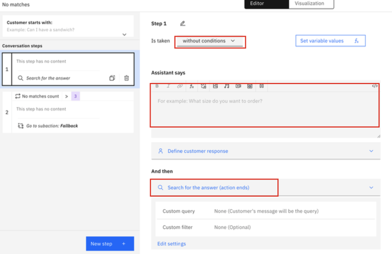

5. Then click on the 2nd step of the **No matches** action and click on the **Delete** icon to delete the step.
   
    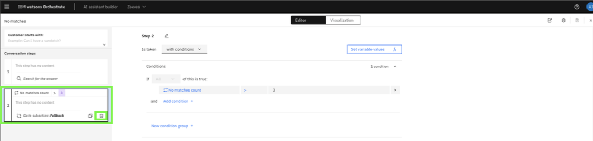

6. Save the settings and **close** the window. 
   
    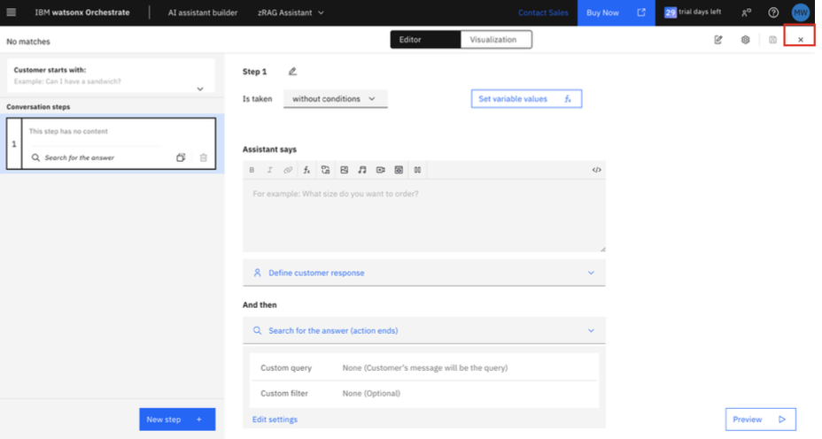

7. Then click the **Fallback** action in the **Actions** table.
   
    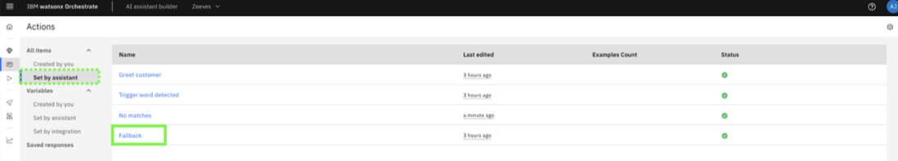

8. Delete **all** of the **Conversation steps** except for the last one (Step 6).
   
    **Note:** You need to select each step individually. Click the **delete** icon and confirm the deletion for the first 5 steps.

    

9. Verify that the first 5 **Conversation steps** are deleted and then click the **x** to close the **Editor** window.
    
    

10. Click the **Global settings** icon.
    
    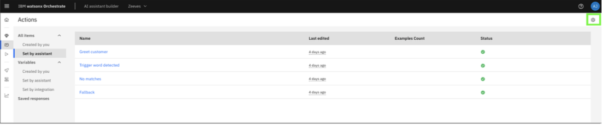

11. Click **No matches** under the **Conversation routing** tab.
    
    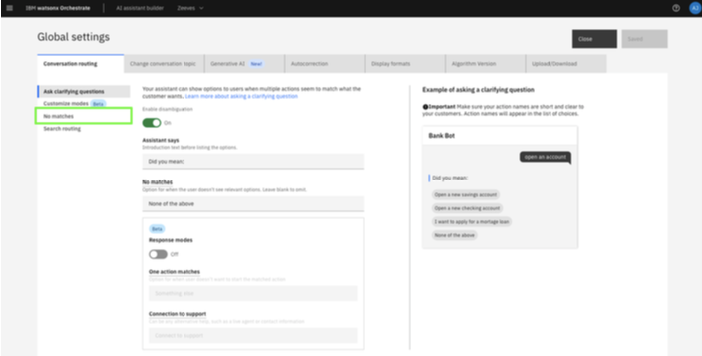

12. Move the slider to **More often**. 
    
    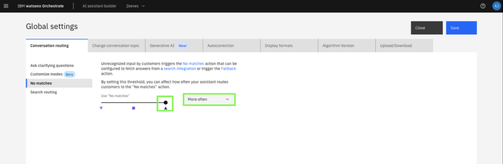

13. Then click the **Autocorrection** tab and toggle the feature to the **Off** position.
    
    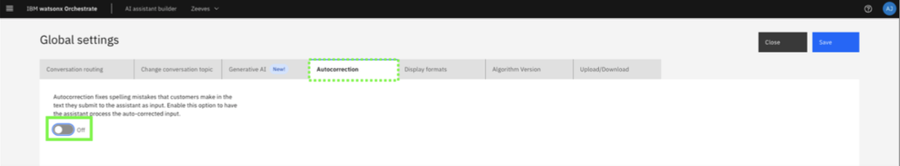

14. Click **Save (a)** and then **Close (b)**. 
    
    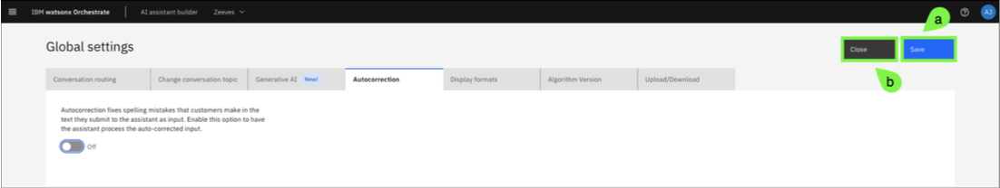

15. Hover over the left-side navigation and click **Environments**.
    
    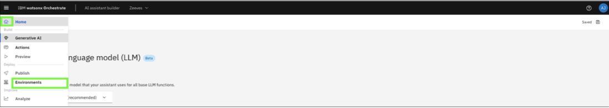

16. Click **Web chat**. 
    
    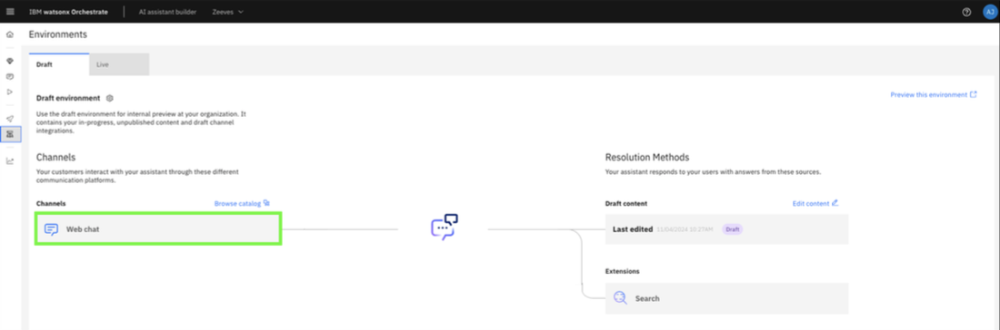

17. On the **Style** tab, click the **Streaming** toggle to enable streaming.
    
    The streaming setting allows responses to be streamed to the assistant and displayed as they are generated versus waiting until the full response is received and then displayed.

    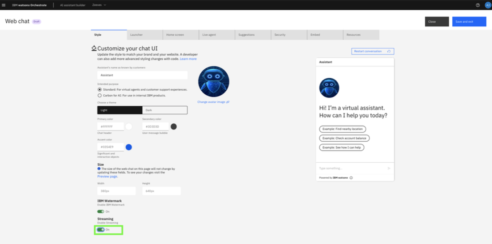

18. Click on the **Home screen** tab. 
    
    Customize the Home screen by setting a custom **Greeting message** and deleting the default **Conversation starters**.

    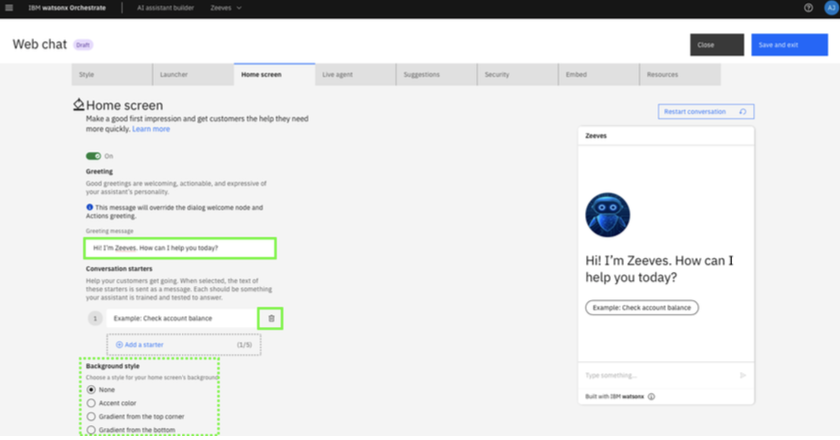

19. Click the **Suggestions** tab and toggle the feature to the **Off** position.
    
    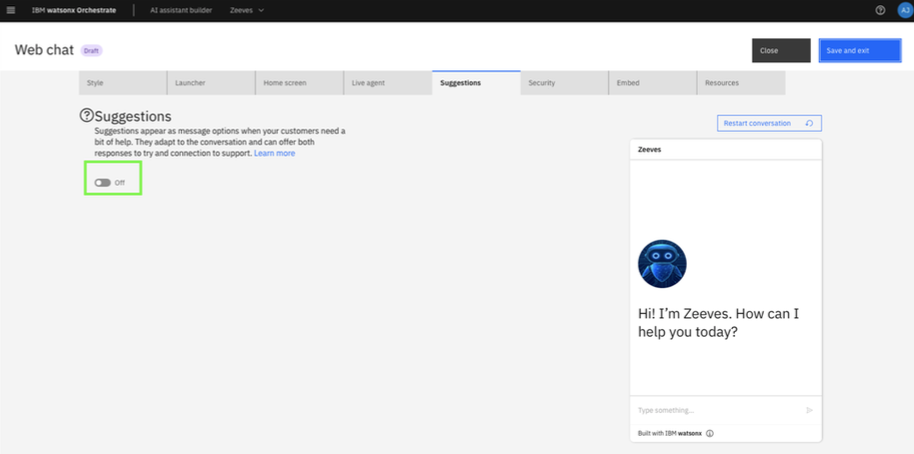

20. Finally, click **Save and exit (a)** and then **Close (b)**.
    
    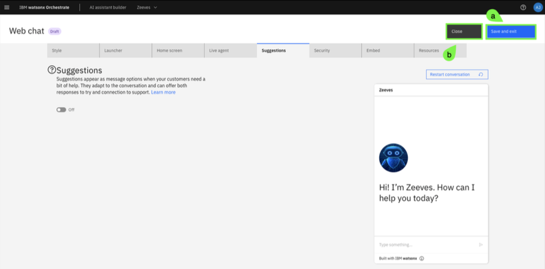

21. Lastly, you will add **prompt instructions** to your assistant to configure how the LLM responds to queries. The prompt instructions help LLMs to guide the conversations with clarity and specificity to achieve the end goal of an action. You can provide instructions to customize the output to an expert or a novice, to answer with a more structured output, such as bullets or examples, as applicable.

    Hover over the left-side navigation and click on **Generative AI**.

    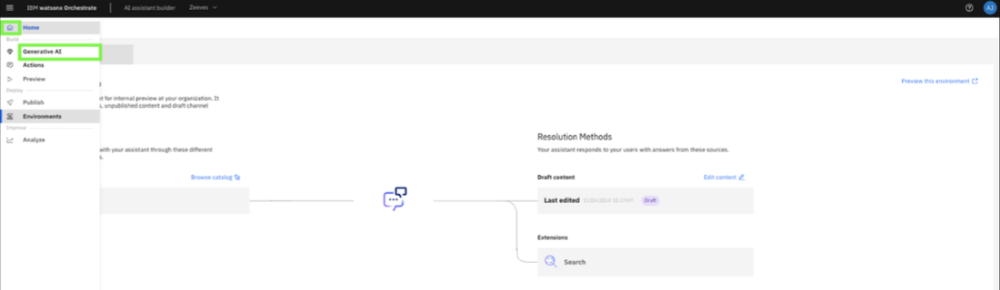

22. Click **Add instructions**. 
    
    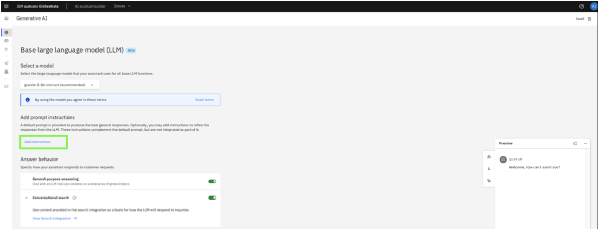

23. In the **Add prompt instructions** text box, copy and paste the following example:
    
    ```
    You are a subject matter expert on mainframe systems. Respond to all prompts with truth and accuracy. Provide answers in a bulleted list with headings. Provide examples and commands when requested. DO NOT guess the answer.
    ```

    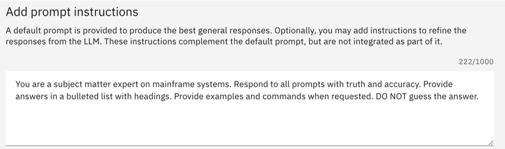

    ***NOTE:** Prompt instructions are highly customizable and should be tested prior to delivering a demo or pilot. The provided prompt instructions above are just one example.*