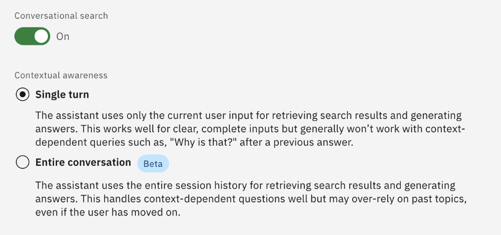
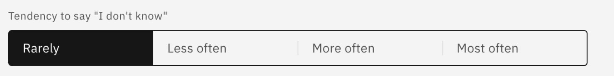
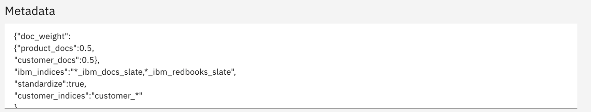

# Configure settings for conversational search

After enabling conversational search by connecting your OpenSearch instance to the assistant, you’ll see additional settings that can be modified for fine-tuning how your assistant responds to questions. These settings can be updated based on your requirements. For example:

- **Contextual awareness**

    Options include **Single turn** and **Entire conversation**.

    **Single turn** is best for contexts that require only current input to retrieve search results and to generate answers. The assistant answers each question individually without building a context from previous questions and answers.

    **Entire conversation** is used for context-dependent questions, which often considers previous inputs. 
    
    ***NOTE:*** **Entire conversation** uses the whole session to continue the conversation. It may bring back subjects that are no longer in the scope of the conversation. Therefore, irrelevant context may yield suboptimal results. When conversing with the AI Assistant, if there is a query that is not related to the current subject, it is recommended to restart the conversation and then type the query for more accurate results.

- **Define the text for the citations title**

    Specify the text that appears to instruct the user to expand the list of citations in the assistant (except web chat client). The **Default** is `How do we know?`

- **Tendency to say `I don't know`**

    Used to tune the tendency of your assistant to say “*I don’t know*” in conversational search. Options include:

    - Rarely
    - Less often
    - More often
    - Most often

    By default, **Less often** is selected, although the recommended option is **Rarely**, which allows the Assistant to provide a general answer to a query. However, if there are more incorrect answers than expected, you can raise the threshold to **Less often**.

    You can select the other options such as **More often** and **Most often**, as required. However, this increases the frequency of “I don’t know” responses.

- **Generated response length**

    The generated response-length feature customizes response lengths to best meet your needs. Options include:

    - Concise
    - Moderate
    - Verbose

    This will adjust the length of responses that your assistant gives to better fit your needs in conversational search. The default setting is **Moderate**, but **Verbose** has performed well in testing for Q&A.

    Learn more about tuning this setting <a href="https://cloud.ibm.com/docs/watson-assistant/watson-assistant?topic=watson-assistant-conversational-search#tuning-the-generated-response-length-in-conversational-search" target="_blank">here</a>.

- **Default filter**

    The **Default filter** field allows you to include or exclude specific products from your conversational search. For more details on how to set this filter as well as the full list of products that can be included or excluded, see step 10 <a href="https://www.ibm.com/docs/en/watsonx/waz/2.0.0?topic=assistants-configuring-your-conversational-search#tasktask_k1z_vty_mdc__steps__1" target="_blank">here</a>.

- **Metadata**

    The **Metadata** field provides a way to adjust your assistant’s behavior during conversational search for your OpenSearch instance. You can specify which topics or document indicies are referenced in its content-grounded search. If you leave the metadata field empty, then it defaults to settings found to perform well. For example, OpenSearch searches all the default IBM-provided documentation and all of the ingested customer documentation with an equal weighting.

    As an example, the ***doc_weight*** parameter defines the weight distribution between IBM documents and customer documents. For example, if you provide the value 0.2 for *product_docs* and 0.8 for *customer_docs*, then the data search in customer documents is prioritized over product documents.

    For more details on the ways to configure the **Metadata** field, reference the documentation in Step 11 <a href="https://www.ibm.com/docs/en/watsonx/waz/2.0.0?topic=assistants-configuring-your-conversational-search#tasktask_k1z_vty_mdc__steps__1" target="_blank">here</a>.

- **Search display text**

    The **Search display** text options speicy the default text displayed when no results are found or when connectivity issues to the backend search service occur. The defaults are usually sufficient.

***For more details on the conversational search settings, reference the <a href="https://www.ibm.com/docs/en/watsonx/waz/2.0.0?topic=assistants-configuring-your-conversational-search" target="_blank">IBM Docs page here</a>.***

1. For the initial configuration of your AI assistant with the default zRAG documentation, set **Contextual awareness** to ***Single turn***.
   
    

2. For the ***Tendency to say “I don’t know”*** option, select the recommended option of **Rarely**.
   
    

3. For the ***Generated response length*** option, select **Verbose**.
    
    

4. In the **Metadata** field text box, copy and paste the following:
   
    ```
    {"doc_weight":
    {"product_docs":0.5,
    "customer_docs":0.5}, "ibm_indices":"*_ibm_docs_slate,*_ibm_redbooks_slate", "standardize":true,
    "customer_indices":"customer_*"
    }
    ```

    ***NOTE:** this is the **default** setting and won’t change the behavior of the conversational search. The result is weight product docs and customer ingested docs equally. Later in this Lab you will modify this field to prioritize customer ingested docs.*

    

5. Leave all other defaults and click **Save**.
   
    

6. Finaly, click **Close**. 