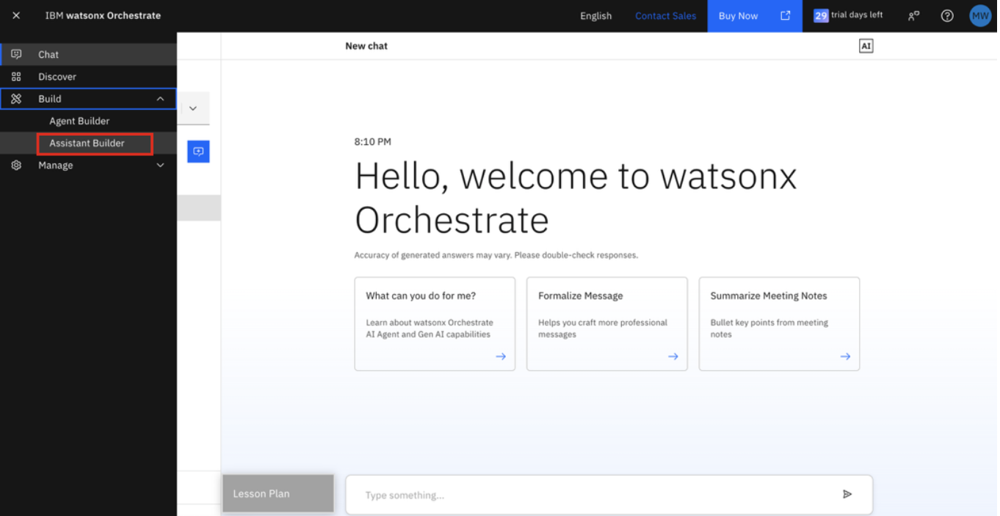
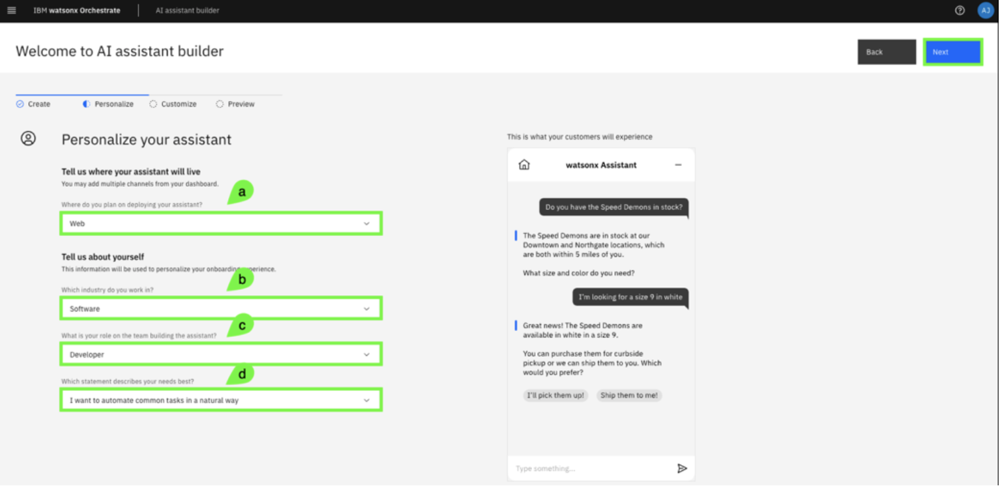
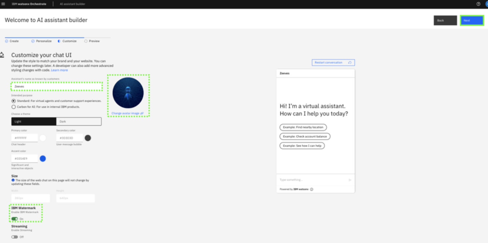
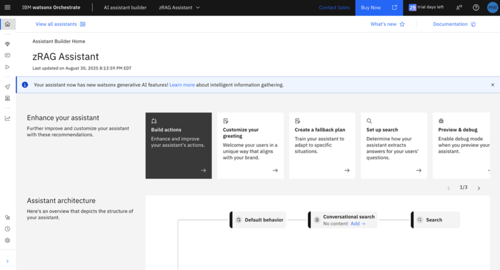

# Create a zRAG Assistant

In this section, you will create an assistant for the purpose of answering questions to a range of IBM Z related questions.

1. Once logged into the watsonx Orchestrate UI, **click on the ‘hamburger’ menu icon** in the top-left corner and click on **Build --> Assistant Builder**.
   
    

2. Enter a **name** and optional description for your assistant, and click **Next**.
   
    

3. Complete the **Personalize your assistant** form and click **Next**.
   
    **a.** Select **Web**. 

    **b.** Select the industry of your choice

    **c.** Select the role of your choice

    **d.** Select the need of your choice

    

4. Complete the **Customize your chat UI** form and click **Next**.
   
    *For best results, toggle the **Streaming** option to **On***. 

    

5. Preview your assistant and then click **Create**. 
   
    

6. The assistant is now created.
   
    

