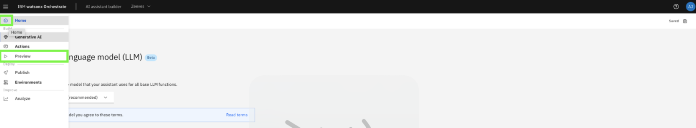
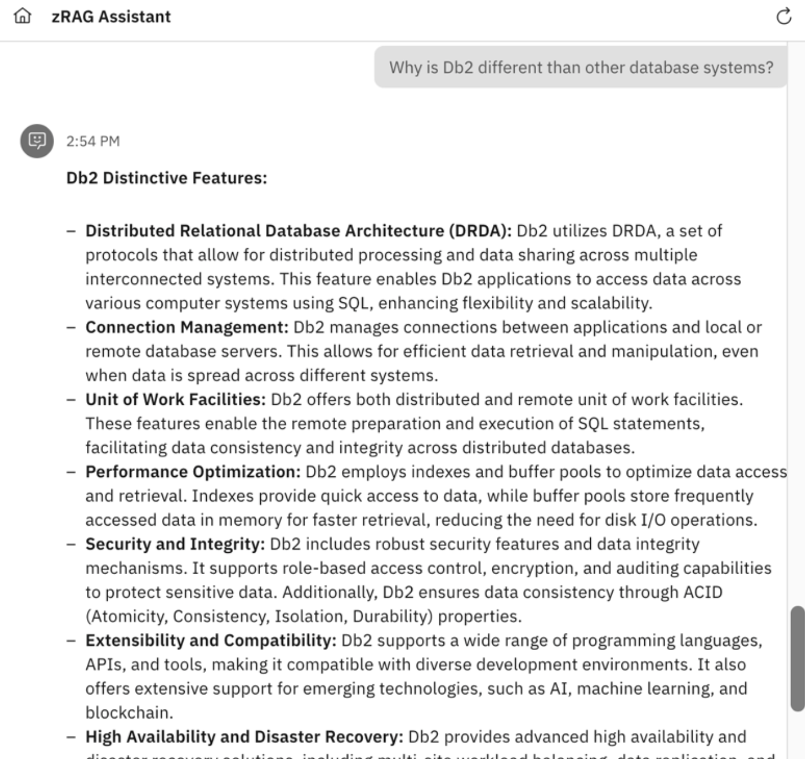
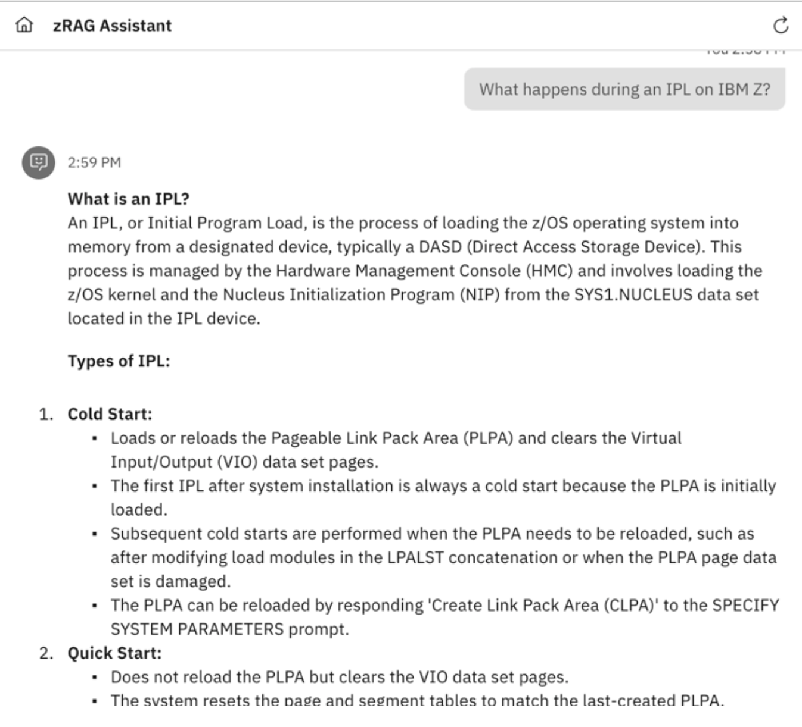
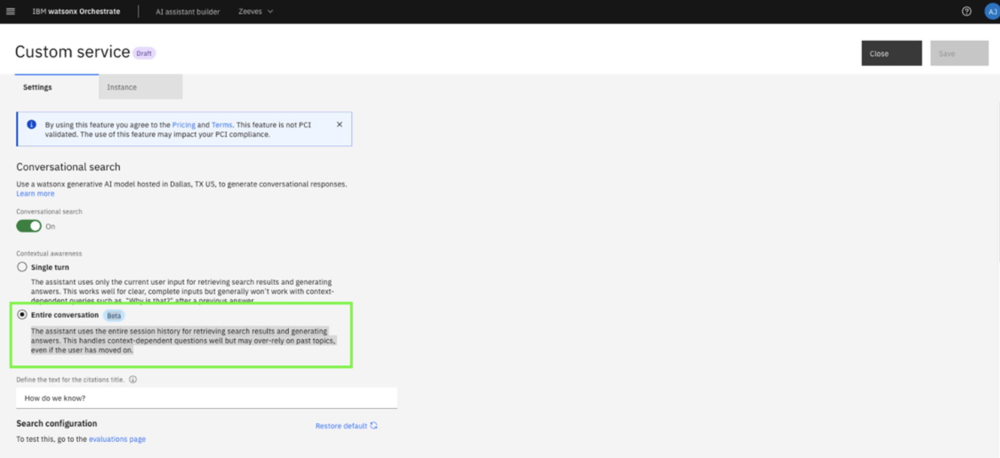

# Testing conversational search with zRAG connection

Now you can begin issuing queries to test the assistant’s responses. For more detailed responses, try appending `Please provide a detailed response` to the end of your question.

**Important:** Modify settings iteratively based on your assessment of response quality. Review and change them at any time. For example, add extra prompt instructions, change response verbosity, and modify OpenSearch indexes.

1. Hover your cursor over the left-side navigation and click **Preview**. 
   
    

2. In the **Preview assistant** screen, click **Change layout** at the top and then select **Fullscreen -> Save** to make the chat window full screen.
   
    

3. Experiment with different prompts and validate that the answers are reasonable and related to IBM Z.
   
    Other prompts and responses follow.


    **Note:** The responses that you receive can vary from the ones shown.

    **Prompt:**
    ```
    What is the APF list in z/OS?
    ```

    ***Example output:***
    

    **Prompt:**
    ```
    Why is Db2 different than other database systems?
    ```

    ***Example output:***
    

    **Prompt:**
    ```
    What is the latest version of Db2 for z/OS?
    ```

    ***Example output:***
    

    **Prompt:**
    ```
    What is the operator command used to check the Db2 for z/OS version level?
    ```

    ***Example output:***
    

    **Prompt:**
    ```
    What happens during an IPL on IBM Z?
    ```

    ***Example output:***
    

4. Experiment with the **Multi-turn** Q&A capability by changing your custom service **contextual awareness** setting from **Single turn** to **Entire conversation**.
   
    

5. Go back to the **Preview** chat to test sequential prompts like those shown below. 
   
    **NOTE:** *make sure to restart the conversation after enabling multi-turn.*

    **Prompts:**

    ```
    What is the APF list in z/OS?
    ```
    ```
    How do you add a library to it?
    ```
    ```
    Show me how if my library is PROD1.LOADLIB on volume PRD001.
    ```

*You have now created and deployed your own assistant with conversational search capabilities, and your client can understand how watsonx Assistant for Z provides its content-grounded responses to any Z-related questions. This was done by configuring your assistant to use the zRAG that has over 220 knowledge sources, and uses this knowledge to provide AI-generated responses.*

*In the following section, you will demonstrate how clients can personalize their assistant with an internal knowledge base that contains documentation they add to the RAG. This will provide a level of context- awareness of their own internal processes and procedures when company-specific questions are asked to the assistant.*

